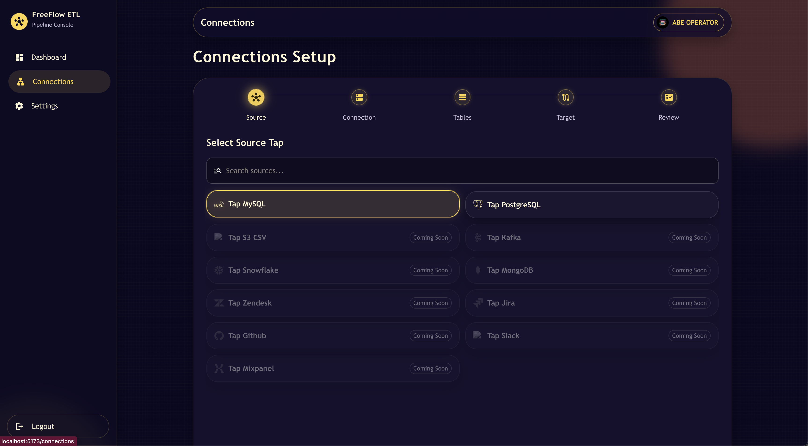
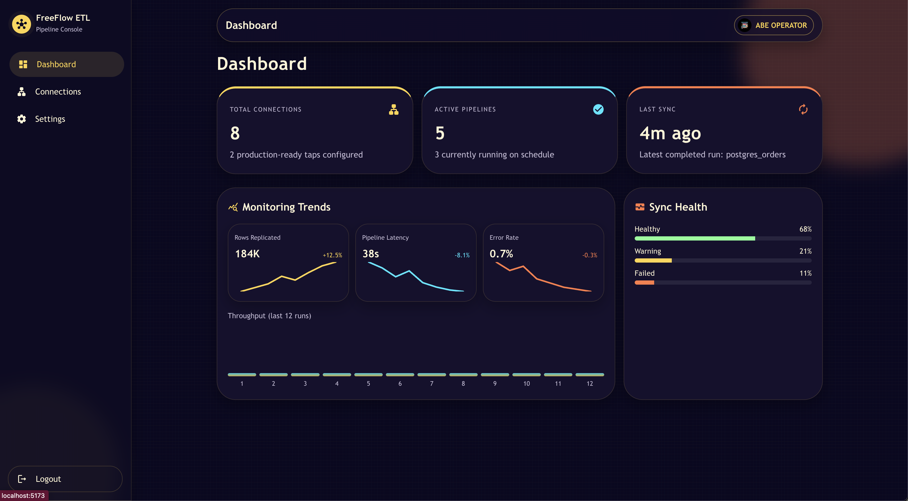

# FreeFlow ETL UI

A sleek, framework-first **PipelineWise-inspired control plane UI** built with **React + Material UI + Vite**.

> Status: **UI-first scaffold**. Backend execution logic is intentionally not wired yet.

## Screenshots




## What This App Supports

### Core Navigation
- Sidebar-based desktop layout with animated background
- Mobile drawer behavior
- Page routing for Dashboard, Connections, and Settings

### Auth Flow (Frontend Mock)
- Username + password login screen with animated visual design
- Route protection for app pages
- Session persisted in `localStorage`
- Sidebar logout action that clears session and returns to login

### Connections Wizard (Multi-Step)
- Step flow: `Source -> Connection -> Tables -> Target -> Review`
- Sliding step transitions and dynamic card/container sizing
- Progress stepper with completion glow indicators

#### Source Selection
- Searchable source catalog with icons
- Supported now (active):
  - MySQL
  - PostgreSQL
- Listed but disabled (grayed):
  - S3 CSV
  - Kafka
  - Snowflake
  - MongoDB
  - Zendesk
  - Jira
  - Github
  - Slack
  - Mixpanel

#### Connection Configuration
- Guided, collapsible setup sections
- Source credential inputs (clean labels)
- Advanced options (GTID, filters, batch/stream settings, schemas)
- `DB Type` fixed as `mariadb/mysql` in current UI

#### Table Selection
- Dedicated table screen (not mixed with connection form)
- Sortable, table-based layout
- Per-table controls:
  - select/unselect
  - replication method (`LOG_BASED` default, `INCREMENTAL`, `FULL_TABLE`)
  - cursor column required for incremental mode
  - expandable column preview
- Header checkbox in Select column for bulk select/clear of visible rows
- Search and filtering support

#### Target Selection
- Target options:
  - Snowflake
  - CSV
  - S3

#### Review & Config Preview
- PipelineWise-style YAML preview scaffolding for source + target configs
- Enrollment-style final action flow

### Dashboard
- KPI summary cards
- Monitoring/health visual blocks and charts (UI mock data)

### Settings
- Sectioned settings UI:
  - Workspace
  - Notifications
  - Profile
  - RBAC
  - User Management

#### Notifications (Webhook-Based)
- Provider options with icons:
  - Slack
  - Discord
  - Teams
  - Custom
- Separate webhook endpoints for:
  - Failed events
  - Success events
- Test button for each webhook channel (UI action)

#### Profile
- Profile name and role fields
- Profile image uploader with instant preview
- Auto-generated default avatar when no image exists
- Header profile avatar updates from saved profile data

#### RBAC & User Management
- Role template selector and permission toggles
- User enrollment/management form controls

## Tech Stack
- React
- React Router
- Material UI (MUI)
- Vite

## Project Structure

```text
src/
  components/
    AppShell.jsx
  pages/
    DashboardPage.jsx
    ConnectionsPage.jsx
    SettingsPage.jsx
    LoginPage.jsx
    LogoutPage.jsx
  data/
    connectionOptions.js
```

## Run Locally

```bash
npm install
npm run dev
```

Build for production:

```bash
npm run build
```

## Important Notes
- This repository focuses on **frontend UX and flow design**.
- No actual connector credentials are executed against databases yet.
- No live webhook delivery is performed in this scaffold.
- YAML shown in review is generated as UI preview/config scaffolding.

## License
MIT (see `LICENSE`)
